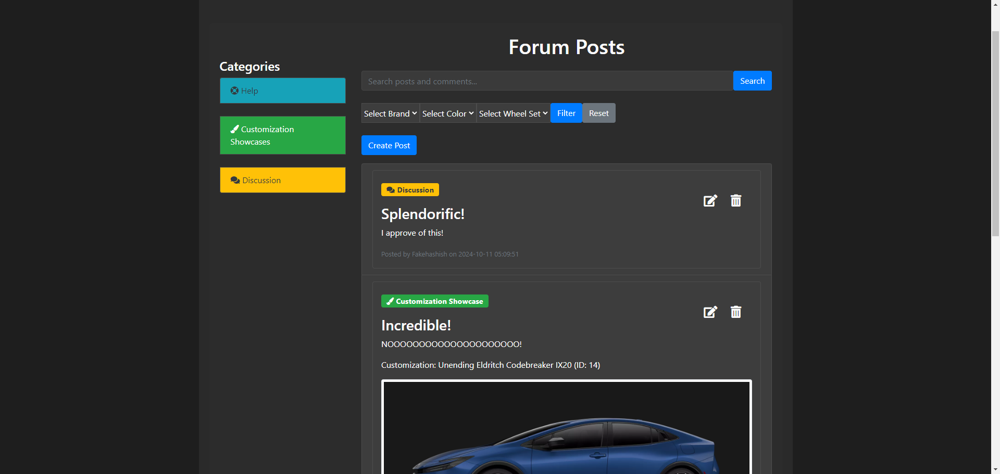

# CarCraft User Guide

## Requirements

Our project is built using **Flask**, a lightweight and flexible Python web framework, to develop the web application. It leverages **Python** as the main programming language and integrates **SQLite3** as the database system to manage and store data. Flask handles the routing, user authentication, form validation, and dynamic content rendering, while SQLite3 is used for all database operations, providing a reliable and simple database solution. This setup ensures an efficient, scalable, and easy-to-maintain application with clean code structure and secure data management.

Below are the libraries required to run this project.

1. **Flask==3.0.3**
   - Flask is a lightweight web framework for Python. It is commonly used for creating web applications and APIs. Version 3.0.3 is specified here.

2. **Flask-Bootstrap==3.3.7.1**
   - Flask-Bootstrap integrates Bootstrap, a popular front-end framework, with Flask, providing a set of templates and tools for developing web interfaces with a responsive design.

3. **Flask-Inputs==1.0.0**
   - Flask-Inputs is used for handling and validating form inputs within Flask applications, simplifying user input processing.

4. **Flask-Login==0.6.3**
   - Flask-Login provides user session management, making it easier to handle user authentication and remember user sessions securely.

5. **Flask-SQLAlchemy==3.1.1**
   - Flask-SQLAlchemy integrates SQLAlchemy, a powerful Object-Relational Mapping (ORM) library, with Flask. It helps in managing database queries and handling data models within Flask applications.

6. **Flask-WTF==1.2.1**
   - Flask-WTF integrates WTForms, a flexible forms library, with Flask. It simplifies creating forms and validating user inputs.

7. **Werkzeug==3.0.3**
   - Werkzeug is a comprehensive WSGI (Web Server Gateway Interface) library that powers Flask's request and response handling. It provides utilities to manage server-side requests and responses.

8. **Jinja2==3.1.4**
   - Jinja2 is a templating engine for Python, used by Flask to generate dynamic HTML pages from templates.

9. **itsdangerous==2.2.0**
   - Itsdangerous provides security utilities for cryptographically signing data, which is often used in Flask for handling things like secure session cookies.

10. **click==8.1.7**
    - Click is a library for creating command-line interfaces. It is used by Flask to enable command-line tools such as starting the server and managing projects.

11. **MarkupSafe==2.1.5**
    - MarkupSafe provides a way to safely handle HTML and XML text, escaping special characters to prevent code injection attacks in web applications.

## Setting Up The Environment

1. The required libraries can easily be installed using the `requirements.txt` with `pip`.

    ```bash
    pip install -r requirements.txt
    ```

2. Before running the program, `dummy_populate_db.py` must be run to set up the database. This can be done through the command line. **Note**: Make sure the Python executable is properly added to your system's PATH before attempting this step. You can follow this [guide](https://realpython.com/add-python-to-path/) to ensure Python is correctly configured.

    ```bash
    python dummy_populate_db.py
    ```

3. Once the database tables have been created, you can start the program with the following command in the terminal:

    ```bash
    python app.py
    ```
    
## CarCraft Application

### Creating an Account

In order to access all features of this website, an account must be created using the menu shown above. During account creation, it can be specified whether the account is a `regular user` or an `admin`.

Assuming that the above set up was done, these accounts should be available.

| Username       | Password       | Type  |
| -------------- | -------------- | ----- |
| admin          | admin          | Admin |


### Features

1. Customization (**All Users**)
    - Users can create and save customized vehicles with attributes like model, color, and wheels.
2. Forums (**All Users**)
    - Users can create posts, comment on discussions, and share their customized vehicles.
3. Admin Dashboard (**Admins Only**)
    - **Users**: Manage the registered users of the platform. You can view user details, edit user information, or delete users.
    - **Vehicle Types**: Add, edit, or delete different categories of vehicle types available on the platform.
    - **Brands**: Add, edit, or delete car brands available on the platform.
    - **Models**: Add, edit, or delete car models, which are based on brand and vehicle type.
    - **Colors**: Add, edit, or delete available colors for vehicle customization.
    - **Wheel Sets**: Add, edit, or delete different wheel sets that users can choose when customizing their vehicles.


### Gallery

<div style="display: flex;">
    
    
</div>

<div style="display: flex;">
    
    
</div>

<div style="display: flex;">
    
    
</div>